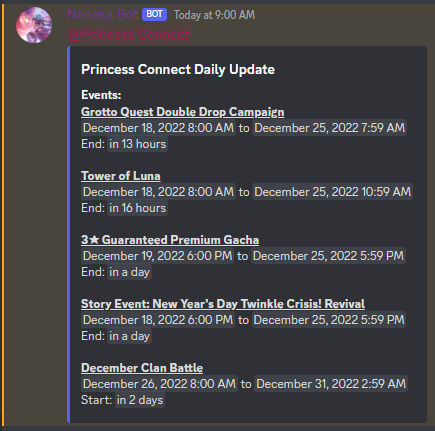
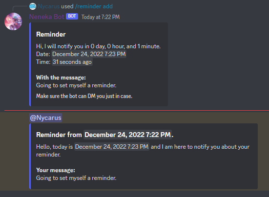
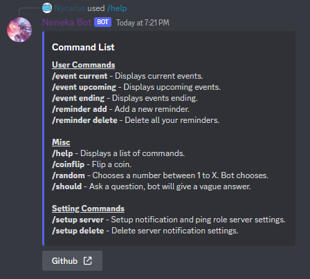

# Neneka-Bot
[Invite discord bot to your server.](https://discord.com/api/oauth2/authorize?client_id=1049874702497234955&permissions=423054789696&scope=bot%20applications.commands)

Discord bot that gets latest events, create reminders, and displays events. Built for some of the basic needs of casual Princess Connect players, but mostly for personaly use.

# Features
| Events | Reminders |
|     :---:      |     :---:      |
|  |  |

The core features of the discord bot revolve around time management. Here are a list of things the bot can do.

- Daily notifications of events ending or starting within 48 hours at daily reset (2 PM UTC) to all subscribed servers, where the server owner or admin chooses the channel where the bot will post and role to ping.
- Commands to get upcoming events, events ending, or current events which are all web scraped off Crunchyroll's website
- Create reminders for yourself. The bot will remind you through either the channel or by direct messaging if it is unable to ping you through the server. There can be an error within 1 minute margin.
- Some fun extra commands.


# How to run locally
```
# Fill .env and then create docker image and container by running this command
docker-compose up --build

# Remove docker container
docker-compose down
```

# Full list of commands
<p align="center">
    
</p>